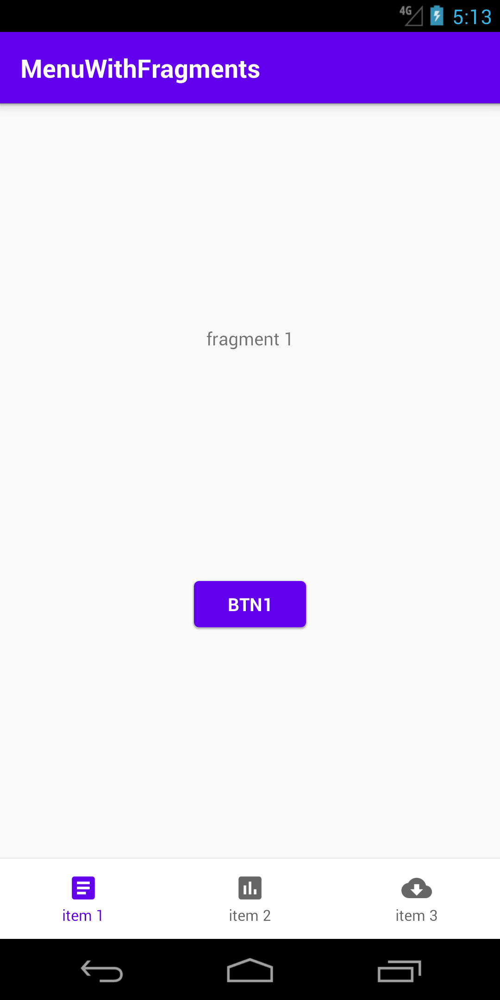
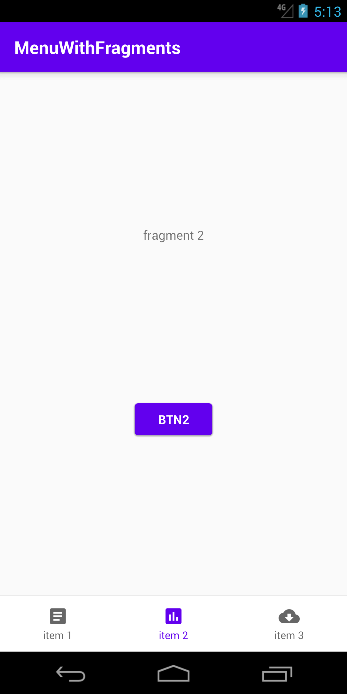
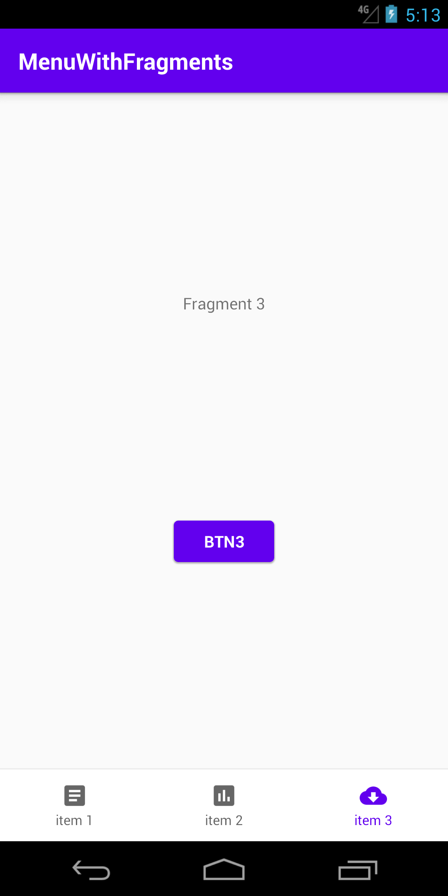

## Menu + Fragment + Navigation + Binding

A simple model app with a bottom menu that allows the user to navigate through some fragments.
It is also possible to click a button on a fragment to navigate to another fragment.
It uses view binding.

