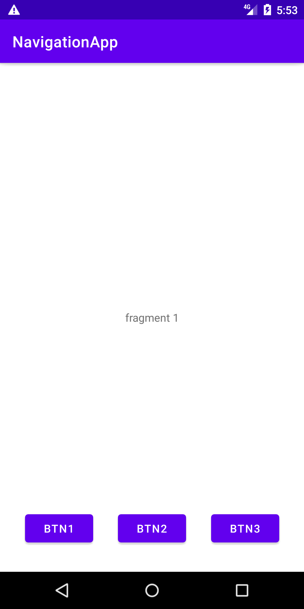
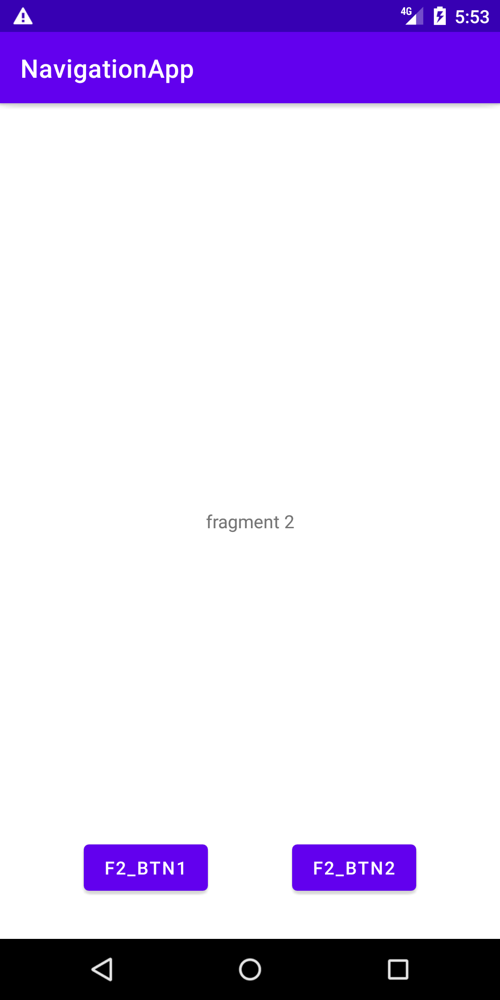
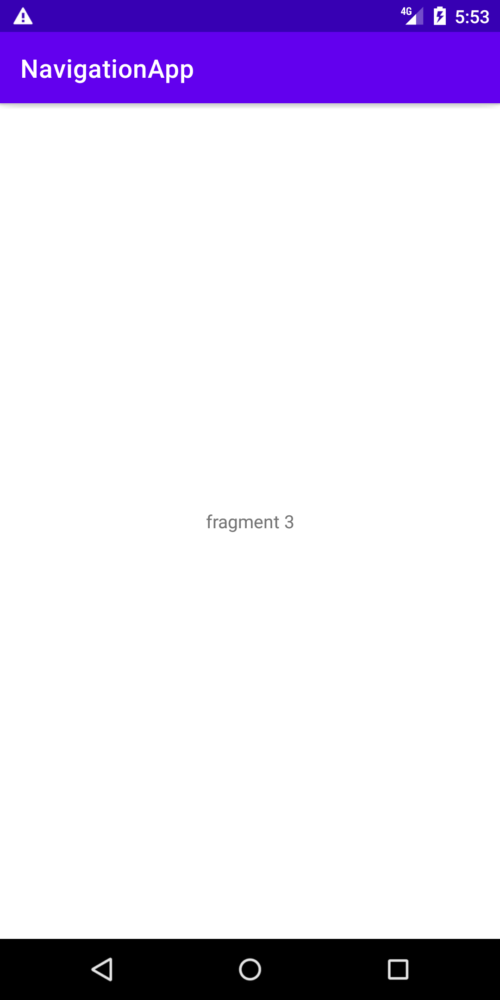

## Navigation + Fragments

A simple model app with 1 activity, 7 fragments and a navigation component.
The user can navigate through the fragments just by clicking in some buttons.
The paths through the fragments are defined in the navigation graph.

