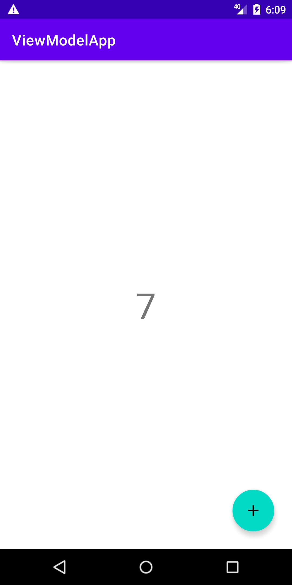
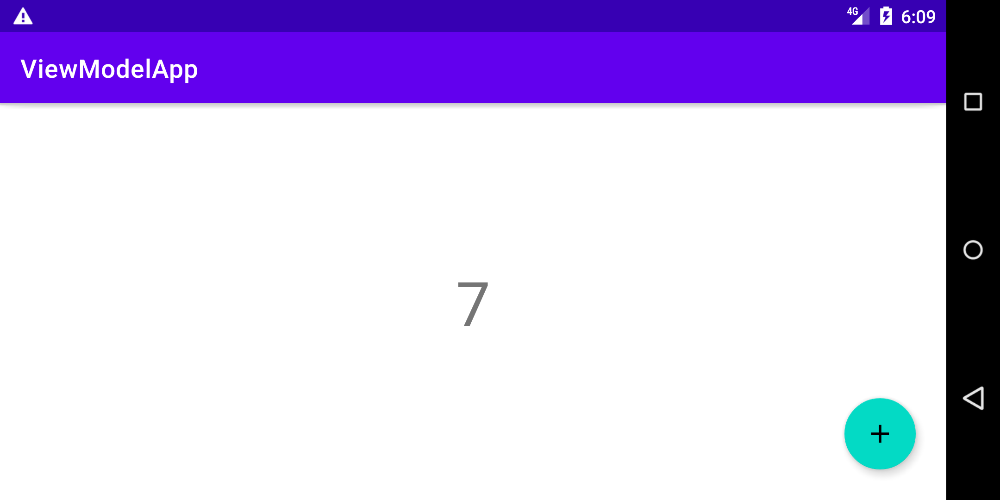

## ViewModel + Counting App

A simple model app that counts the number of clicks on the button.
It doesn't change state when the screen is rotated.
This is a simple implementation of a ModelView.

